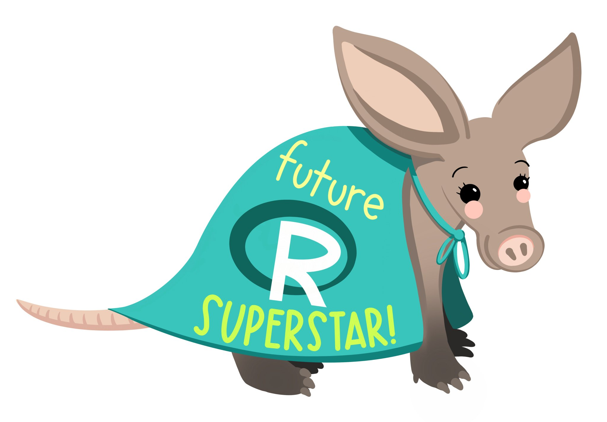

# DSU R training

> This repo contains all the materials used in the R colloquium for the fall of 2021. 

The DSU R colloquium for the fall of 2021 was attended mainly by the Office of Institutional Effectiveness. A big thank you to <a href="https://github.com/allisonhorst">Allison Horst</a> for her R related artwork. Her images make learning R so much more fun.  

--- 

## Getting Started

The first thing you should do is add your name to this README.md file. The way that you will do this is by cloning the repo, changing this file by adding your name to the list, and then pushing your new commit up to github.

<h4>Colloquium Participants</h4>

- Matt
- Brenten
- Joy
- Craig
- Justin
- Andrea
---

<h4>Once you have cloned the Repo</h4>

Once you have cloned the repo, you should look through the files using RStudio. The first files we will work with are in the folder 01_getting_started. The materials in the getting started folder will be covered in our meetings from July 29 to August 12. The topics we will cover are

- Intro to RMarkdown
- Intro to ggplot2
- Intro to dplyr

The first file you should open is the file 00_intro_to_markdown.Rmd. If you can open that file and "knit" it, you are ready to roll!
 
 

